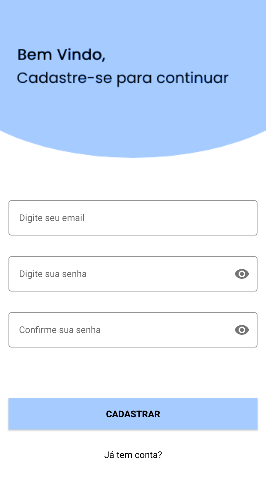

# LoginAndSignUpKotlin

## Sobre esse projeto 💡

Projeto independente desenvolvido em Kotlin com intuito de aprender mais sobre Firedatabase

#### <strong>Status: </strong>Concluído ✔️

   

# Tecnologias utilizadas 💻
- [X] Kotlin
- [X] Firedatabase
- [X] Figma
# Comentários Finais 🎂

Esse projeto foi muito muito para o meu aprendizado em kotlin, nele tive o desafio de criar um aplicativo que pudesse fazer o login, cadastro e ainda tivesse a opção de sair da conta, tudo isso em firedatase, um banco de dados na nuvem atualizado instantenêamente para o usuário, pretendo reutilizar meus conhecimentos adquiridos nesse projeto para futuras aplicações de maior complexidade, sempre valorizando uma interface simples e intuitiva, por ultimo o figma, que serviu para eu espandir meus conhecimentos na criação de bons designs para projetos.

# Autor

- Github - [@RodrigoCotrin](https://github.com/RodrigoCotrin/)
- Linkedin - [@RodrigoCotrin](https://www.linkedin.com/in/rodrigocotrin/)

***
[MIT LICENSE](https://github.com/RodrigoCotrin/LoginAndSignUpKotlin/blob/main/LICENSE)
